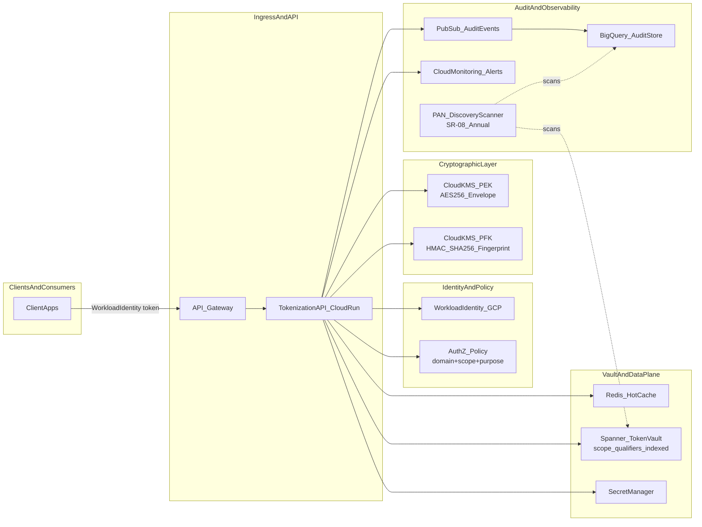
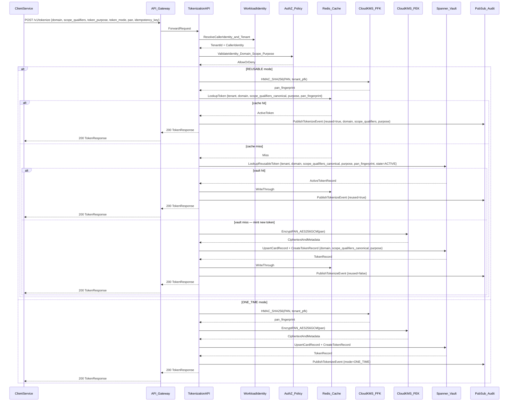
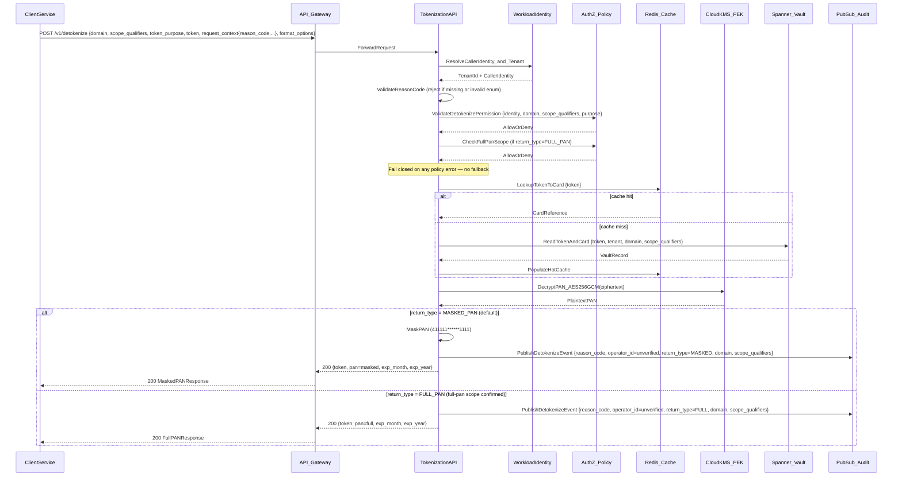
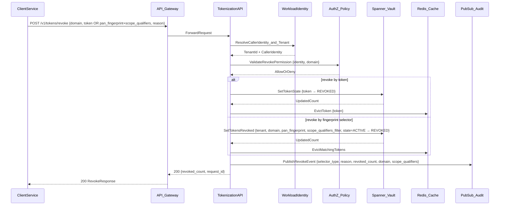

# Architecture And Event Sequence Diagrams

## System Fit Diagram

**Key architectural properties:**
- Caller tenant is resolved from Workload Identity — not from request body.
- Two KMS key classes: PEK for AES-256-GCM PAN encryption; PFK for HMAC-SHA-256 fingerprint only. Never interchangeable.
- PAN discovery scanner (SR-08) runs out-of-band, scanning audit and storage targets for out-of-vault PAN presence.
- All human access to any component in the identity, crypto, and data subgraphs requires MFA (SR-07).

---

## Tokenize Sequence

---

## Detokenize Sequence

---

## Revoke Sequence

---

## Failure And Control Notes

- **Detokenize fails closed**: Any policy check failure, policy service unavailability, or scope mismatch returns an error. No fallback to allow. MFA policy for human CDE access is enforced at the IdP layer, not bypassed by this service.
- **Scope mismatch on detokenize**: Returns `404 TOKEN_NOT_FOUND` — same response as token not found — to avoid disclosing whether the token exists under a different scope.
- **Cache failures**: Degrade to Spanner read path. Cache bypass is transparent to callers. Authorization cannot be bypassed on cache failure.
- **PFK and PEK are separate KMS operations**: The fingerprint computation (PFK) and PAN decryption (PEK) are distinct KMS calls with distinct keys and IAM roles. A compromise of one does not expose the other.
- **Audit events**: Every tokenize, detokenize, revoke, and denied request publishes to Pub/Sub. Audit events never contain PAN, CVV, or full key material.
- **PAN discovery (SR-08)**: Runs out-of-band against Cloud Logging buckets, BigQuery audit tables, and Spanner exports. Findings outside vault boundary trigger incident procedures per OR-04.
