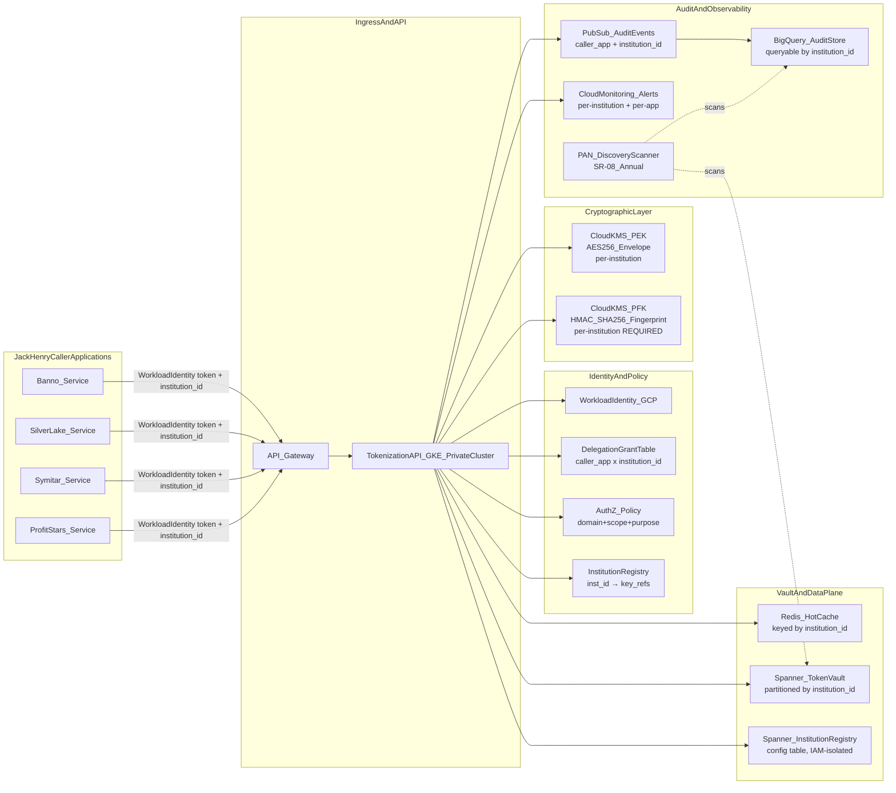
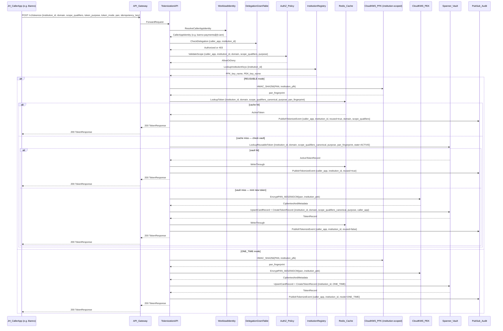
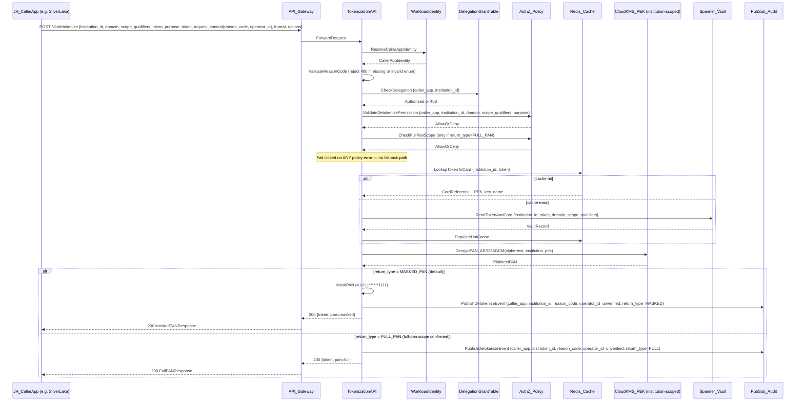
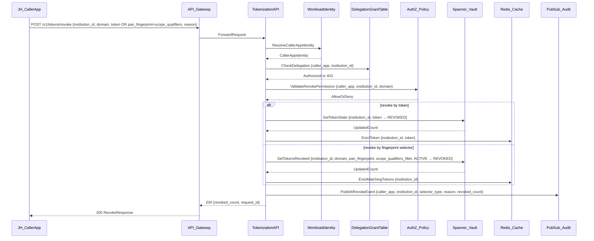

# Architecture And Event Sequence Diagrams

## System Fit Diagram

**Key architectural properties:**
- All caller applications (Banno, SilverLake, Symitar, ProfitStars) authenticate via Workload Identity. `institution_id` is always a request parameter — never derived from the caller identity alone.
- The **Delegation Grant Table** is the primary cross-institution access control: maps `(caller_app_identity, institution_id)` to permitted operations, domains, and purposes.
- The **Institution Registry** maps `institution_id` to its Cloud KMS key references (PFK key name, PEK key name). Stored in a dedicated Spanner config table with IAM roles isolated from vault data tables.
- Both PFK and PEK are **institution-scoped** — one per institution. PFK (HMAC fingerprinting) and PEK (envelope encryption) are provisioned together at institution onboarding.
- All Spanner data is partitioned by `institution_id` as the leading key. Redis cache keys include `institution_id`.
- Audit events include both `caller_application` (JH product) and `institution_id` (bank/credit union) as mandatory indexed fields.
- PAN discovery scanner runs out-of-band against all CDE-adjacent storage (SR-08).
- All human access to any component in the identity, crypto, and data subgraphs requires MFA (SR-07).

---

## Tokenize Sequence

---

## Detokenize Sequence

---

## Revoke Sequence

---

## Failure And Control Notes

- **Delegation check is step 2, always**: Before any vault operation, the service validates the calling application's delegation grant for the supplied `institution_id`. A misconfigured or compromised JH application that passes the wrong `institution_id` is blocked here.
- **Institution-scoped PFK as defense-in-depth**: Even if delegation check were bypassed, a token issued under institution A's PFK cannot produce a valid fingerprint match in institution B's vault. Cross-institution token reuse structurally fails at lookup.
- **Detokenize fails closed**: Any policy check failure, grant lookup error, or scope mismatch returns an error. No fallback to allow. `institution_id` mismatch returns `404 TOKEN_NOT_FOUND` — same as not found — to avoid disclosing cross-institution token existence.
- **Cache is institution-partitioned**: Redis cache keys include `institution_id`. A cache implementation bug cannot serve institution A's data to institution B.
- **Audit events are dual-keyed**: Every event carries both `caller_application` (which JH product) and `institution_id` (which bank/credit union). This supports per-institution compliance reporting and per-application anomaly detection independently.
- **PAN discovery (SR-08)**: Runs out-of-band against Cloud Logging buckets, BigQuery audit tables, Spanner exports, and Redis snapshots. Findings trigger incident procedures per OR-04.
- **Institution onboarding is a prerequisite**: The Institution Registry must contain a valid entry for `institution_id` with PFK and PEK key references before any API call for that institution will succeed.
